# ☁️ Serverless Employee Management System

<div align="center">


[](https://aws.amazon.com/)
[](https://aws.amazon.com/lambda/)
[](https://aws.amazon.com/dynamodb/)
[](https://www.python.org/)
[](LICENSE)

**A Cloud-Native CRUD Application demonstrating the power of Event-Driven Architecture.**

[Live Demo](#) • [Architecture](#-architecture) • [Deployment Guide](#-deployment-guide) • [API Docs](#-api-documentation)

</div>

---

## 📖 Overview

This project is a full-stack **Serverless Web Application** that enables users to create and retrieve employee records securely. By removing the need to manage servers (EC2), the application achieves high availability, automatic scaling, and near-zero idle costs.

### ⚡ Key Capabilities
*   **Zero Infrastructure Management:** No OS patching or server provisioning.
*   **Event-Driven Compute:** Logic runs only when API requests are made.
*   **NoSQL Performance:** Millisecond latency for data retrieval.
*   **Static Web Hosting:** Frontend served globally via S3 (highly durable).

---

## 🏗️ Architecture

### 🔄 Data Flow Sequence

This diagram illustrates the lifecycle of a request from the user's browser to the database.

```mermaid
sequenceDiagram
    participant User as 👤 User Browser
    participant S3 as 🪣 S3 (Frontend)
    participant APIG as 🚪 API Gateway
    participant Lambda as λ Lambda Function
    participant DB as 🗄️ DynamoDB

    User->>S3: Load index.html & script.js
    S3-->>User: Return Static Assets
    
    Note over User, DB: Scenario: Add Employee
    
    User->>APIG: POST /employees (JSON Data)
    APIG->>Lambda: Trigger postEmployee.py
    Note right of Lambda: Import Boto3<br/>Parse JSON
    Lambda->>DB: put_item()
    DB-->>Lambda: Success (200 OK)
    Lambda-->>APIG: Return JSON Response
    APIG-->>User: Display "Saved!"
```



### 🛠️ Technology Stack

| Component | Service | Role |
| :--- | :--- | :--- |
| **Frontend** |  | Hosts HTML, CSS, and JS files. |
| **API Layer** |  | RESTful interface connecting frontend to backend. |
| **Compute** |  | Python functions executing business logic. |
| **Database** |  | Key-Value store for employee records. |
| **SDK** |  | AWS SDK for Python to interact with DynamoDB. |

---

## 📂 Repository Structure

```bash
employee-management/
├── 📂 lambda/
│   ├── 🐍 getEmployee.py      # Scan operation (Read)
│   └── 🐍 postEmployee.py     # PutItem operation (Write)
├── 📂 frontend/
│   ├── 📄 index.html          # UI Structure
│   ├── ⚡ script.js           # Fetch API logic
│   └── 🧪 test.html           # Isolated component testing
├── 🖼️ Serverless Project.jpeg # Architecture Design
├── ⚙️ .gitignore
└── 📜 README.md
```

---

## 🚀 Deployment Guide

### Prerequisites
*   AWS Free Tier Account
*   Basic understanding of JSON

### Phase 1: The Database (DynamoDB)
1.  Navigate to **DynamoDB** Console -> **Create Table**.
2.  **Table Name:** `employeeData` (Case sensitive!).
3.  **Partition Key:** `employeeid` (String).
4.  Use default settings and create.

### Phase 2: The Security (IAM)
*Crucial Step: Lambda needs permission to talk to DynamoDB.*

1.  Go to **IAM** -> **Roles** -> **Create Role**.
2.  Use case: **Lambda**.
3.  Create a **Custom Inline Policy** (Best Practice vs FullAccess):
    <details>
    <summary>📄 <b>Click to view JSON Policy</b></summary>

    ```json
    {
        "Version": "2012-10-17",
        "Statement": [
            {
                "Effect": "Allow",
                "Action": [
                    "dynamodb:PutItem",
                    "dynamodb:Scan"
                ],
                "Resource": "arn:aws:dynamodb:REGION:ACCOUNT_ID:table/employeeData"
            },
            {
                "Effect": "Allow",
                "Action": "logs:*",
                "Resource": "*"
            }
        ]
    }
    ```
    </details>

### Phase 3: The Backend (Lambda)
1.  Create `getEmployee` function (Python 3.x). Paste code from `lambda/getEmployee.py`.
2.  Create `postEmployee` function (Python 3.x). Paste code from `lambda/postEmployee.py`.
3.  **Important:** Attach the IAM Role created in Phase 2 to both functions.

### Phase 4: The API (API Gateway)
1.  Create a **REST API**.
2.  Create Resource `/employees`.
3.  Create Method **GET** -> Point to `getEmployee` Lambda.
4.  Create Method **POST** -> Point to `postEmployee` Lambda.
5.  **Enable CORS** on the resource (Actions -> Enable CORS).
6.  **Deploy API** -> Copy the **Invoke URL**.

### Phase 5: The Frontend (S3)
1.  Open `script.js` in your text editor.
2.  Replace `const API_URL = "..."` with your **Invoke URL**.
3.  Create an S3 bucket (Uncheck "Block all public access").
4.  Upload `index.html` and `script.js`.
5.  Enable **Static Website Hosting** in bucket properties.

---

## 📡 API Documentation

Test your backend before connecting the frontend using cURL or Postman.

### `POST /employees`
Adds a new employee.

**cURL Example:**
```bash
curl -X POST https://your-api-id.execute-api.us-east-1.amazonaws.com/dev/employees \
     -H "Content-Type: application/json" \
     -d '{"employeeid": "101", "name": "Alice", "department": "DevOps", "salary": "90000"}'
```

### `GET /employees`
Retrieves all records.

**cURL Example:**
```bash
curl https://your-api-id.execute-api.us-east-1.amazonaws.com/dev/employees
```

---

## 💰 Cost Analysis (Free Tier)

This architecture is extremely cost-effective. For low-traffic portfolios, it is essentially free.

| Service | Free Tier Allowance | Project Usage Estimate | Cost |
| :--- | :--- | :--- | :--- |
| **Lambda** | 400,000 GB-seconds / month | < 100 seconds | **$0.00** |
| **API Gateway** | 1 Million calls / month | < 1,000 calls | **$0.00** |
| **DynamoDB** | 25 GB Storage | < 1 KB | **$0.00** |
| **S3** | 5 GB Storage | < 1 MB | **$0.00** |

---

## 🛡️ Security & Improvements

While this project demonstrates functionality, a production environment would require:

*   **Authentication:** Integrate **Amazon Cognito** to secure the API Gateway endpoints.
*   **Infrastructure as Code:** Use **AWS SAM** or **Terraform** to deploy resources automatically instead of using the console.
*   **Validation:** Add backend data validation in Python (currently relies on frontend JS).
*   **Environment Variables:** Store Table Names in Lambda Environment Variables instead of hardcoding.

---

## 🤝 Contributing

1.  Fork the repository.
2.  Create a feature branch (`git checkout -b feature/NewFeature`).
3.  Commit your changes.
4.  Push to the branch.
5.  Open a Pull Request.

---

## 📜 License

Distributed under the MIT License. See `LICENSE` for more information.

---

<div align="center">

**[⬆ Back to Top](#%EF%B8%8F-serverless-employee-management-system)**

</div>
